# 02 — DOMAIN MODEL (Domain-Driven Design)
## Valencia Nutracare Decision Platform (VNDP)

**Authority:** Chief Enterprise Architect
**Source of truth:** [BUSINESS_ONTOLOGY.md](BUSINESS_ONTOLOGY.md)
**Aligns with:** [01_SYSTEM_ARCHITECTURE.md](01_SYSTEM_ARCHITECTURE.md) (bounded contexts §4) · [DATABASE_SCHEMA.md](DATABASE_SCHEMA.md) · [KNOWLEDGE_GRAPH.md](KNOWLEDGE_GRAPH.md)
**Status:** Tactical DDD model · v1.0

---

## 1. Purpose & DDD conventions

This document is the **tactical domain model** — it takes the 14 ontology entities and expresses them as DDD **Aggregates**, **Entities**, and **Value Objects**, defines the relationships and invariants between them, and renders a complete **ERD**.

### Building-block definitions used here
| Block | Definition | Test |
|---|---|---|
| **Entity** | has a distinct identity that persists through change; mutable | "do we care *which* one?" → yes |
| **Value Object (VO)** | defined entirely by its attributes; immutable; no identity | "are two with equal attributes interchangeable?" → yes |
| **Aggregate** | a cluster of entities + VOs treated as one consistency boundary | changes commit together |
| **Aggregate Root** | the single entity that is the entry point; guards all invariants | only the root is referenced from outside |
| **Domain Event** | a fact that happened, crossing aggregate boundaries | past-tense name |

### Aggregate design rules (enforced throughout)
1. **Reference other aggregates by identity only** (never hold a direct object reference) — keeps boundaries clean and enables the event-driven recompute (01 §8).
2. **One aggregate = one transaction** — invariants inside a root are always consistent; cross-aggregate consistency is *eventual*, via domain events.
3. **The root owns its invariants** — e.g. a `BOM` root guarantees its lines and derived cost/box are coherent.
4. **Scenario-scoping** — financial/projection aggregates carry a `ScenarioRef` so two scenarios never share mutable state (the reproducibility guarantee, and the structural cure for the `#REF!` cascade).

---

## 2. Context → Aggregate map

| Bounded Context (01 §4) | Aggregates | Covers ontology entities |
|---|---|---|
| Product & Recipe | **ProductCatalog**, **BillOfMaterials**, **Ingredient** | Product, BOM, Ingredient |
| Demand & Market | **Market** | Market |
| Competitive Intelligence | **Competitor** | Competitor |
| Marketing & Compliance | **HCPEngagement** (Hospital, Doctor) | Hospital, Doctor |
| Finance & P&L | **RevenueProjection**, **ExpensePlan**, **WorkingCapital** | Revenue, Expense, Inventory |
| Capital & Financing | **FundingRound** (+ Capex) | Funding Round |
| Valuation & Returns | **Valuation** | Valuation |
| Decision / Planning | **Strategy** | Strategy |
| Scenario & Simulation | **Scenario** (root of reproducibility) | Scenario |

---

## 3. Value Object Catalogue (shared, immutable)

These VOs are reused across aggregates. Equality is by value; all are immutable.

| Value Object | Attributes | Invariant |
|---|---|---|
| **Money** | `amount: decimal`, `currency = 'INR'` | amount has 4 dp; currency fixed INR (Cr is presentation only) |
| **Percentage** | `fraction: decimal` | `0 ≤ fraction` (ratios of revenue ≤ 1) |
| **Quantity** | `value: decimal`, `unit ('g'|'kg')` | `value ≥ 0` |
| **Rate** | `amount: Money`, `perUnit ('kg'|'g')` | `amount ≥ 0` |
| **BoxSize** | `grams ∈ {400, 500}` | natal=500, infant/child=400 |
| **TierLevel** | `level ∈ {1,2,3}`, `label` | 1=Metro/Premium, 2=Mid, 3=Value |
| **FiscalYear** | `yearNo ∈ 1..5`, `label`, `start`, `end` | `end > start` |
| **DateRange** | `from`, `to?` | non-overlapping per owner (temporal) |
| **FundingMix** | `equityPct: Percentage`, `debtPct: Percentage` | `equityPct + debtPct = 1` |
| **Margin** | `type ('gross'|'ebitda'|'net')`, `pct: Percentage` | derived, not stored raw |
| **CostPerBox** | `raw: Money`, `packaging: Money`, `conversion: Money`, `total: Money` | `total = raw+packaging+conversion` |
| **SAMShare** | `pct: Percentage`, `tier: TierLevel`, `year: FiscalYear` | `0 ≤ pct ≤ 1`; family tier-shares sum ≈ 1 |
| **ManufacturingMode** | `value ('contract'|'in_house'|'third_party')` | enum |
| **DiscountRate** | `ke`, `kd`, `wacc: Percentage` | `wacc = f(equity,debt,ke,kd)` |
| **CashFlow** | `year: FiscalYear`, `amount: Money`, `direction ('in'|'out')` | — |
| **Confidence** | `level ('low'|'medium'|'high')` | enum |
| **BrandName / Flavour / SkuCode** | `text` | non-empty |

---

## 4. Aggregates

> Notation: **(R)** = aggregate root · **(E)** = entity · **(VO)** = value object · **→ref** = references another aggregate by identity.

### 4.1 ProductCatalog  — *Product & Recipe context*
- **ProductFamily (R)** — PP / LP / IFP / CNP. Holds `code`, `name`, `BoxSize (VO)`, `GSTRate (VO)`.
  - **ProductVariant (E)** — trimester / age-stage / base.
  - **Brand (E)** — one per `TierLevel` (Wonder Womb, Garbhika…). `BrandName (VO)`.
  - **SKU (E)** — sellable unit = family × variant × `TierLevel` × `Flavour`. `SkuCode (VO)`, `BoxSize (VO)`, `activeFromYear`.
- **Invariants:** SKU box size = family box size; SKU tier has a matching Brand; SKU count per year matches the active set (4→14→24).
- **→ref:** `BillOfMaterials` (by family), `Market` (SAM), `ScenarioRef`.
- **Covers:** **Product**.

### 4.2 BillOfMaterials — *Product & Recipe context*
- **BOM (R)** — recipe per family+version. Holds `batchCost (Money)`, `packaging (Money)`, `conversion (Money)`, `CostPerBox (VO, derived)`, `BoxSize (VO)`.
  - **BomLine (E)** — `→ref Ingredient`, `Quantity per100g (VO)`, `Quantity perBox (VO)`.
- **Invariants:** Σ line `per100g` = 100 g; `CostPerBox.raw = Σ(perBox × ingredient rate)`; `total = raw+packaging+conversion`. **CostPerBox is derived, never stored stale** (the explicit fix for the workbook's stale-value defect).
- **→ref:** `Ingredient` (by id), `ProductFamily`.
- **Covers:** **BOM**.

### 4.3 Ingredient — *Product & Recipe context*
- **Ingredient (R)** — `name`, `UoM`, `→ref Commodity` (raw market).
  - **IngredientPrice (E)** — `Rate (VO)`, `DateRange (VO)`, `source`.
- **Invariants:** no overlapping price `DateRange` for one ingredient (temporal exclusivity).
- **Covers:** **Ingredient** (+ Commodity as referenced market node, see KNOWLEDGE_GRAPH).

### 4.4 Market — *Demand & Market context*
- **Market (R)** — addressable demand for a family.
  - **SAMShareEntry (E/VO)** — `SAMShare (VO)` per `TierLevel` × `FiscalYear`; demand forecast volumes.
- **Invariants:** per family+year, tier shares are coherent (≈ sum to 1); SAM feeds BPH/volume.
- **→ref:** `ProductFamily`.
- **Covers:** **Market**. *(Houses the TAM→SAM→SOM model the workbook lacks — ontology §8.2.)*

### 4.5 Competitor — *Competitive Intelligence context*
- **Competitor (R)** — HealthKart, Kapiva, OZiva, Wellbeing.
  - **CompetitorMetric (E)** — `metricKey`, `Percentage (VO)` or `band (text)`, `note`.
- **Invariants:** one value per (competitor, metric).
- **Covers:** **Competitor**. *(Advisory: benchmarks pressure-test other aggregates' assumptions.)*

### 4.6 HCPEngagement — *Marketing & Compliance context*
- **Channel (R)** — abstract engagement target; `ChannelType (VO)`.
  - **Hospital (E)** — institutional channel (nursing-home tie-ups). `→ref` for detailing spend.
  - **Doctor (E)** — HCP (OBGYN, pediatrician, lactation consultant, KOL).
  - **DetailingEngagement (E)** — spend/reach per channel × year.
- **Invariants:** IMS-Act rule — Tier-1 infant-formula consumer ads = 0; budget shifts to HCP detailing (compliance enforced at root).
- **→ref:** `ExpensePlan` (HCP category), `ProductFamily`.
- **Covers:** **Hospital**, **Doctor**.

### 4.7 WorkingCapital (Inventory) — *Finance & P&L context*
- **WorkingCapitalPlan (R)** — per family × scenario.
  - **MonthlyCashCycle (E)** — `boxes`, `CashFlow (VO)` in/out, opening/closing WC.
- **Invariants:** `closing = opening + (inflow − outflow)`; `rotation = annualRevenue / initialWC`.
- **→ref:** `FundingRound` (funded by), `ScenarioRef`.
- **Covers:** **Inventory**.

### 4.8 RevenueProjection — *Finance & P&L context*
- **RevenueProjection (R)** — scenario+snapshot scoped.
  - **RevenueLine (E)** — per SKU × `TierLevel` × `ManufacturingMode` × `FiscalYear`: `boxes`, `unitPrice (Money)`, `revenue (Money)`, `cogs (Money)`.
- **Invariants:** `revenue = boxes × unitPrice`; lines roll up to family/tier totals.
- **→ref:** `SKU`, `Scenario`, `Snapshot`.
- **Covers:** **Revenue**.

### 4.9 ExpensePlan — *Finance & P&L context*
- **ExpensePlan (R)** — scenario scoped.
  - **ExpenseLine (E)** — per `category` × `TierLevel` × family × `FiscalYear`: `Percentage (of revenue)` **or** `PerBoxAmount (Money)`.
- **Invariants:** exactly one driver set per line; contingency = 5% of indirect; logistics = ₹9→8.5/box; compliance verdicts respected.
- **→ref:** `Channel` (HCP), `RevenueProjection` (for %-of-revenue), `Scenario`.
- **Covers:** **Expense**.

> **Note — the revenue↔expense circularity (ontology §6.8):** `ExpensePlan` (%-of-revenue) depends on `RevenueProjection`, which feeds the P&L that nets expenses. This is a *known* cross-aggregate cycle, resolved by **iterative fixpoint in the Simulation service** (01 §9), never by accidental spreadsheet iteration.

### 4.10 FundingRound — *Capital & Financing context*
- **FundingRound (R)** — 22 / 60 / 220 Cr per year.
  - holds `amount (Money)`, `TierTarget`, `ManufacturingMode`, `purpose`.
  - **CapexAllocation (E)** — `FundingMix (VO)` (equity/debt), capex vs WC split.
  - **DebtTranche (E)** — cumulative debt, `interestRate`.
- **Invariants:** `FundingMix` sums to 1; capex mix 15/85 (Y1-3), 25/75 (Y4-5); WC mix 10/90 (Y4-5).
- **→ref:** `WorkingCapital`, `Capex`, `Scenario`.
- **Covers:** **Funding Round**.

*(Supporting aggregate **Capex** (root: CapexPlan; entities: CapexItem; VOs: Money, DepreciationRate) sits beside FundingRound; depreciation 15% WDV feeds ExpensePlan as D&A.)*

### 4.11 Valuation — *Valuation & Returns context*
- **Valuation (R)** — scenario+snapshot scoped return set.
  - **ReturnMetric (E)** — NPV, PI, EVA, ROCE, ROE, IRR, payback: each a `metric` + `value`.
  - VOs: `DiscountRate (Ke 10.8% / Kd 12%/9% / WACC)`, `CashFlow`, `Multiple`.
- **Invariants:** consumes EBIT/PAT/D&A from P&L + capital from FundingRound; `EVA = NOPAT − capital×WACC`; horizon = 7 yrs.
- **→ref:** `RevenueProjection`/P&L, `FundingRound`, `Scenario`.
- **Covers:** **Valuation**.

### 4.12 Strategy — *Decision / Planning context*
- **Strategy (R)** — the 5-year executive plan.
  - **YearPlan (E)** — per `FiscalYear`: `TierTarget`, `capital (Money)`, `skuCount`, `ManufacturingMode`, `plantsAdded`, `cumulativePlants`.
- **Invariants:** capital only in Y1-3; SKU count flat at 24 from Y3; cumulative plants monotonic (0→1→3→6→9).
- **→ref:** `ProductCatalog`, `FundingRound`, `Scenario`.
- **Covers:** **Strategy**.

### 4.13 Scenario — *Scenario & Simulation context (reproducibility root)*
- **Scenario (R)** — a coherent assumption world.
  - **Assumption (E)** — `key`, `value`, `unit`, `source`, `Confidence (VO)`.
  - **Snapshot (E)** — immutable baseline (`label`, `takenAt`) a run was computed against.
- **Invariants:** one value per (scenario, assumption key); snapshots immutable once created; all projection aggregates carry this `ScenarioRef`.
- **Covers:** **Scenario**. *(This is the aggregate that makes every result reproducible.)*

---

## 5. Entity / VO / Aggregate index (the 14 + supporting)

| Ontology entity | DDD classification | Aggregate (root) |
|---|---|---|
| **Product** | Entity (SKU) under root ProductFamily | ProductCatalog |
| **Ingredient** | Aggregate Root | Ingredient |
| **BOM** | Aggregate Root | BillOfMaterials |
| **Competitor** | Aggregate Root | Competitor |
| **Hospital** | Entity (subtype of Channel) | HCPEngagement |
| **Doctor** | Entity (subtype of Channel) | HCPEngagement |
| **Inventory** | Aggregate Root (WorkingCapitalPlan) | WorkingCapital |
| **Funding Round** | Aggregate Root | FundingRound |
| **Market** | Aggregate Root | Market |
| **Revenue** | Aggregate Root (RevenueProjection) | RevenueProjection |
| **Expense** | Aggregate Root (ExpensePlan) | ExpensePlan |
| **Valuation** | Aggregate Root | Valuation |
| **Strategy** | Aggregate Root | Strategy |
| **Scenario** | Aggregate Root | Scenario |
| *Brand, Variant, SKU* | Entities | ProductCatalog |
| *BomLine* | Entity | BillOfMaterials |
| *IngredientPrice, Commodity* | Entity / ref | Ingredient |
| *Capex, CapexItem* | Aggregate / Entity | Capex |
| *Money, Percentage, Quantity, …* | Value Objects | shared (§3) |

---

## 6. Relationships (aggregate-to-aggregate)

By identity reference only; multiplicities shown.

| From | Relationship | To | Mult. |
|---|---|---|---|
| ProductFamily | has recipe | BOM | 1 : 1 (active version) |
| BOM | composed of | Ingredient | 1 : N |
| Ingredient | sourced from | Commodity | N : 1 |
| ProductFamily | sold across | Market (SAM) | 1 : N (tier×year) |
| Competitor | benchmarks | ProductFamily | M : N |
| Channel (Hospital/Doctor) | receives spend from | ExpensePlan | N : 1 |
| SKU | generates | RevenueProjection.line | 1 : N |
| RevenueProjection | feeds (less) ExpensePlan | ExpensePlan | cyclic (fixpoint) |
| ExpensePlan + RevenueProjection | consolidate to | P&L / EBITDA | N : 1 |
| FundingRound | finances | WorkingCapital, Capex | 1 : N |
| Capex | depreciates into | ExpensePlan (D&A) | 1 : N |
| EBITDA / P&L + FundingRound | feed | Valuation | N : 1 |
| Strategy | governs | ProductCatalog, FundingRound | 1 : N |
| Scenario | parameterizes | ALL projection aggregates | 1 : N |

**Value-chain spine (ontology + KNOWLEDGE_GRAPH):**
`Competitor → Product → Ingredient → Commodity → Cost → Margin → EBITDA → Valuation`.

---

## 7. Complete ERD

> Mermaid `erDiagram` (renders in GitHub/most Markdown viewers). Crow's-foot multiplicities; `PK`/`FK` marked.

```mermaid
erDiagram
    SCENARIO ||--o{ ASSUMPTION : contains
    SCENARIO ||--o{ SNAPSHOT : freezes
    SCENARIO ||--o{ REVENUE_PROJECTION : parameterizes
    SCENARIO ||--o{ EXPENSE_PLAN : parameterizes
    SCENARIO ||--o{ VALUATION : parameterizes
    SCENARIO ||--o{ WORKING_CAPITAL : parameterizes

    STRATEGY ||--o{ YEAR_PLAN : has
    STRATEGY }o--|| SCENARIO : "planned under"

    PRODUCT_FAMILY ||--o{ PRODUCT_VARIANT : defines
    PRODUCT_FAMILY ||--o{ BRAND : "branded per tier"
    PRODUCT_FAMILY ||--o{ SKU : offers
    PRODUCT_FAMILY ||--|| BOM : "has recipe"
    PRODUCT_FAMILY ||--o{ MARKET : "addressed by"
    TIER ||--o{ SKU : places
    TIER ||--o{ BRAND : scopes

    BOM ||--o{ BOM_LINE : contains
    INGREDIENT ||--o{ BOM_LINE : "used in"
    INGREDIENT ||--o{ INGREDIENT_PRICE : "priced by"
    COMMODITY ||--o{ INGREDIENT : sources

    COMPETITOR ||--o{ COMPETITOR_METRIC : reports
    COMPETITOR }o--o{ PRODUCT_FAMILY : benchmarks

    CHANNEL ||--o{ HOSPITAL : "is-a"
    CHANNEL ||--o{ DOCTOR : "is-a"
    CHANNEL ||--o{ EXPENSE_LINE : "receives spend"

    SKU ||--o{ REVENUE_LINE : generates
    REVENUE_PROJECTION ||--o{ REVENUE_LINE : aggregates
    EXPENSE_PLAN ||--o{ EXPENSE_LINE : aggregates
    REVENUE_PROJECTION }o--o{ EXPENSE_PLAN : "fixpoint (rev<->exp)"

    FUNDING_ROUND ||--o{ CAPEX_ALLOCATION : splits
    FUNDING_ROUND ||--o{ DEBT_TRANCHE : draws
    FUNDING_ROUND ||--o{ WORKING_CAPITAL : finances
    FUNDING_ROUND ||--o{ CAPEX : finances
    CAPEX ||--o{ CAPEX_ITEM : itemizes
    CAPEX ||--o{ EXPENSE_LINE : "depreciates into"

    WORKING_CAPITAL ||--o{ MONTHLY_CASH_CYCLE : rotates

    VALUATION ||--o{ RETURN_METRIC : computes
    REVENUE_PROJECTION ||--o{ VALUATION : "feeds (P&L)"
    FUNDING_ROUND ||--o{ VALUATION : "capital base"

    SCENARIO {
        string scenarioId PK
        string name
        int horizonYears
        string status
    }
    PRODUCT_FAMILY {
        string code PK
        string name
        decimal boxSizeG
        decimal gstRate
    }
    SKU {
        string skuId PK
        string familyCode FK
        int tier FK
        string variant
        string flavour
        decimal boxSizeG
        int activeFromYear
    }
    BOM {
        bigint bomId PK
        string familyCode FK
        int version
        decimal batchCost
        decimal packagingCost
        decimal conversionCost
    }
    BOM_LINE {
        bigint bomLineId PK
        bigint bomId FK
        bigint ingredientId FK
        decimal qtyPer100g
    }
    INGREDIENT {
        bigint ingredientId PK
        string name
        string uom
    }
    INGREDIENT_PRICE {
        bigint priceId PK
        bigint ingredientId FK
        decimal ratePerKg
        daterange validPeriod
    }
    COMMODITY {
        string name PK
        string market
        decimal ratePerKg
    }
    COMPETITOR {
        bigint competitorId PK
        string name
    }
    COMPETITOR_METRIC {
        bigint metricId PK
        bigint competitorId FK
        string metricKey
        decimal valuePct
    }
    CHANNEL {
        bigint channelId PK
        string type
        string name
    }
    HOSPITAL {
        bigint channelId PK
        string tieUpType
    }
    DOCTOR {
        bigint channelId PK
        string specialty
    }
    MARKET {
        bigint marketId PK
        string familyCode FK
        int tier FK
        int yearNo
        decimal samShare
    }
    REVENUE_PROJECTION {
        bigint revProjId PK
        bigint scenarioId FK
        bigint snapshotId FK
    }
    REVENUE_LINE {
        bigint revId PK
        bigint revProjId FK
        string skuId FK
        int yearNo
        string mode
        bigint boxes
        decimal unitPriceInr
        decimal revenueInr
        decimal cogsInr
    }
    EXPENSE_PLAN {
        bigint expPlanId PK
        bigint scenarioId FK
    }
    EXPENSE_LINE {
        bigint expenseId PK
        bigint expPlanId FK
        string category
        string familyCode FK
        int tier FK
        int yearNo
        decimal pctOfRevenue
        decimal perBoxInr
    }
    FUNDING_ROUND {
        bigint roundId PK
        int roundNo
        int yearNo
        decimal amountInr
        string tiersTargeted
    }
    CAPEX {
        bigint capexId PK
        bigint scenarioId FK
        int yearNo
        int plantsAdded
    }
    WORKING_CAPITAL {
        bigint wcId PK
        bigint scenarioId FK
        string familyCode FK
        int yearNo
        decimal initialWcInr
        decimal rotation
    }
    VALUATION {
        bigint valuationId PK
        bigint scenarioId FK
        bigint snapshotId FK
    }
    RETURN_METRIC {
        bigint returnId PK
        bigint valuationId FK
        string metric
        decimal value
    }
    STRATEGY {
        bigint strategyId PK
        bigint scenarioId FK
    }
    YEAR_PLAN {
        bigint yearPlanId PK
        bigint strategyId FK
        int yearNo
        string tiersTargeted
        decimal capitalInr
        int skuCount
        string manufacturingMode
        int plantsAdded
    }
    ASSUMPTION {
        bigint assumptionId PK
        bigint scenarioId FK
        string key
        decimal valueNumeric
        string confidence
    }
    TIER {
        int level PK
        string label
    }
```



### 7.1 Aggregate-boundary view (ASCII)
```
┌─Scenario─────────────────────────────────────────────────────────────┐
│  Scenario(R) ─ Assumption(E)* ─ Snapshot(E)*    (parameterizes all ▼) │
└───────────────────────────────────────────────────────────────────────┘
┌─ProductCatalog──────┐ ┌─BillOfMaterials─┐ ┌─Ingredient────────┐
│ ProductFamily(R)    │ │ BOM(R)          │ │ Ingredient(R)     │
│  Variant(E)*        │ │  BomLine(E)*    │ │  IngredientPrice* │
│  Brand(E)*  SKU(E)* │ │  CostPerBox(VO) │ │  →Commodity       │
└─────────┬───────────┘ └────────┬────────┘ └─────────┬─────────┘
          │ generates            │ yields cost         │ rate
          ▼                      ▼                      ▼
┌─RevenueProjection──┐  ┌─ExpensePlan──────┐   ┌─Market─────────┐
│ RevProj(R)         │◄►│ ExpensePlan(R)   │   │ Market(R)      │
│  RevenueLine(E)*   │  │  ExpenseLine(E)* │   │  SAMShare(VO)* │
└─────────┬──────────┘  └────────┬─────────┘   └────────────────┘
          │  EBITDA / P&L         │ D&A ▲
          ▼                       │    │
┌─Valuation──────────┐   ┌─FundingRound───┐   ┌─HCPEngagement──┐
│ Valuation(R)       │◄──│ FundingRound(R)│   │ Channel(R)     │
│  ReturnMetric(E)*  │   │  CapexAlloc(E) │   │  Hospital(E)   │
└────────────────────┘   │  DebtTranche(E)│   │  Doctor(E)     │
┌─Strategy───┐ ┌─Competitor─┐ │ →Capex,WC   │   └────────────────┘
│ Strategy(R)│ │ Competitor │ └─────────────┘   ┌─WorkingCapital─┐
│ YearPlan(E)│ │  Metric(E) │                   │ WCPlan(R)      │
└────────────┘ └────────────┘                   │ MonthlyCycle(E)│
                                                 └────────────────┘
```

---

## 8. Domain Events (cross-aggregate facts)

| Event | Raised by (root) | Drives |
|---|---|---|
| `IngredientPriceChanged` | Ingredient | BOM cost recompute |
| `BomRecomputed` | BOM | RevenueProjection COGS, Valuation |
| `SkuActivated` | ProductCatalog | Strategy SKU count |
| `SamShareUpdated` | Market | Revenue volume |
| `ExpensePlanRevised` | ExpensePlan | P&L, Compliance check |
| `ComplianceVerdictIssued` | HCPEngagement | ExpensePlan allow/block |
| `FundingRoundClosed` | FundingRound | Capex, WC, Valuation capital base |
| `AssumptionUpdated` | Scenario | mark runs stale |
| `SnapshotCreated` | Scenario | freeze baseline for a run |
| `SimulationCompleted` | (Simulation svc) | Valuation, agents |
| `ReturnsComputed` | Valuation | Investor decision |

---

## 9. Invariants & consistency boundaries (summary)

| Aggregate | Key invariant (always true at the root) |
|---|---|
| BillOfMaterials | Σ line per-100g = 100 g; cost/box derived, never stale |
| Ingredient | no overlapping price periods |
| ProductCatalog | SKU box size = family; SKU has matching tier brand |
| Market | tier SAM shares coherent per family/year |
| ExpensePlan | one driver per line; 5% contingency; logistics ₹/box; IMS-Act compliant |
| FundingRound | FundingMix sums to 1; mix policy per year |
| Valuation | EVA = NOPAT − capital×WACC; 7-yr horizon |
| Strategy | capital only Y1-3; cumulative plants monotonic |
| Scenario | snapshots immutable; one value per assumption key |

**Eventual consistency:** the revenue↔expense cycle (4.9) and all downstream P&L→Valuation links are reconciled by the Simulation service's iterative fixpoint and domain events — never inside a single transaction across aggregates.

---

## 10. Mapping to other models

| DDD aggregate | DATABASE_SCHEMA | KNOWLEDGE_GRAPH node | Bounded context (01) |
|---|---|---|---|
| ProductCatalog | `core.skus/brands/product_variants` | `:Product/:Brand/:ProductFamily` | Product & Recipe |
| BillOfMaterials | `core.boms/bom_lines` | `:BOM` | Product & Recipe |
| Ingredient | `core.ingredients/ingredient_prices` | `:Ingredient/:Commodity` | Product & Recipe |
| Market | `core.markets` | `:Market` | Demand & Market |
| Competitor | `core.competitors/_metrics` | `:Competitor` | Competitive Intelligence |
| HCPEngagement | `core.channels` | `:Channel` | Marketing & Compliance |
| WorkingCapital | `proj.working_capital` | `:WorkingCapital` | Finance & P&L |
| RevenueProjection | `proj.revenue_projection` | `:Revenue` | Finance & P&L |
| ExpensePlan | `plan.expense_assumptions` | `:Expense` | Finance & P&L |
| FundingRound / Capex | `core.funding_rounds`,`plan.capex_plan` | `:FundingRound/:Capex` | Capital & Financing |
| Valuation | `proj.returns` | `:Valuation` | Valuation & Returns |
| Strategy | `plan.scenarios` (+ year plan) | — | Decision/Planning |
| Scenario | `plan.scenarios/assumptions/data_snapshots` | `:Scenario` | Scenario & Simulation |

---

*End of 02_DOMAIN_MODEL.md — the tactical DDD model for the Valencia Nutracare Decision Platform, governed by BUSINESS_ONTOLOGY.md.*
